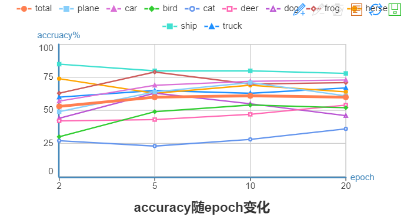
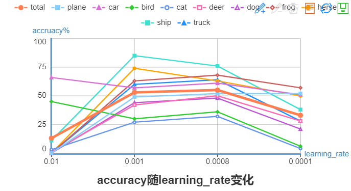
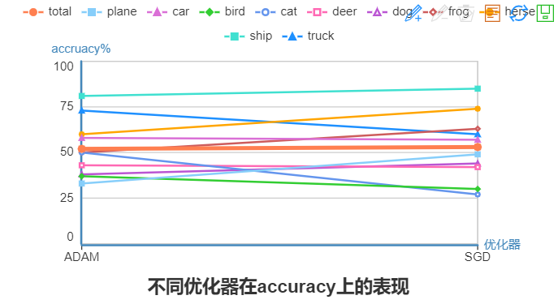
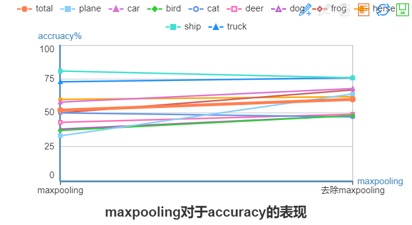
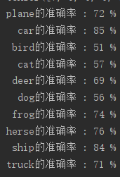
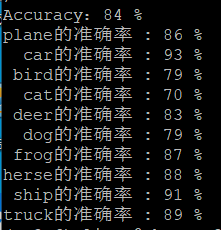

数据集说明
===
CIFAR-10是一个常用的彩色图片数据集，它有10个类别: 'airplane', 'automobile', 'bird', 'cat', 'deer', 'dog', 'frog', 'horse', 'ship', 'truck'。每张图片都是33232，也即3-通道彩色图片，分辨率32*32。

项目说明
===
本项目尝试对CIFAR-10数据集进行分类，具体步骤如下：
- 使用torchvision加载并预处理CIFAR-10数据集
- 定义网络
- 定义损失函数和优化器
- 训练网络并更新网络参数
- 测试网络

**执行方法**：
按顺序执行以下文件，
- data_load.py（读入数据）,
- model.py（定义模型，本项目还设计了以model为后缀的几个模型，比基础模型性能有提升）,
- train.py（训练模型）,
- validation.py（测试模型）

最好的模型性能准确率为84%。:+1:

参数变化分析
===
首先使用基础模型
```md
trainloader=torch.utils.data.DataLoader(trainset,batch_size=4,shuffle=True,num_workers=0)
```
初始batch_size=4
```md
#搭建网络
def __init__(self):
#super()调用下一个父类，并返回父类实例的一个方法
     super(Net,self).__init__()
#3*32*32经过6个5*5的filter，变为6*28*28，再maxpooling，为6*14*14
     self.conv1=nn.Sequential(nn.Conv2d(3,6,5),nn.ReLU(),nn.MaxPool2d(2))
#6*14*14经过16个5*5的filter，变为16*10*10，再maxpooling，变为16*5*5
     self.conv2=nn.Sequential(nn.Conv2d(6,16,5),nn.ReLU(),nn.MaxPool2d(2))
#经过两次卷积，图片变为16*5*5，全连接层将它变成64
     self.fc1=nn.Linear(16*5*5,64)
#第二层全连接，变为32
     self.fc2=nn.Linear(64,32)
#最后一层全连接，输入为32，输出为10（因为最后要分成十类）
     self.fc3=nn.Linear(32,10)

#定义神经网络数据流向
def forward(self,x):
     x=self.conv1(x)
     x=self.conv2(x)
#将16*5*5的数据拉平
     x=x.view(x.size(0),-1)
#第一层全连接,激活
     x=F.relu(self.fc1(x))
#第二层全连接，激活
     x=F.relu(self.fc2(x))
#第三层全连接,不用激活，作为输出
     x=self.fc3(x)
     return x
```
这个模型使用了两层卷积，三层全连接，每一层卷积后使用maxpooling操作。学习率为0.001，使用交叉熵损失函数，优化器使用SGD。
```md
import torch.optim as optim
#定义损失函数,使用交叉熵损失函数
criterion=nn.CrossEntropyLoss()
#随机梯度下降，学习率为0.001，动量为0.9，防止局部最优
optimizer=optim.SGD(net.parameters(),lr=0.01,momentum=0.9)
```
loss和optimizer上，学习率为0.01，使用交叉熵损失函数，优化器使用SGD。

基于这个模型变换参数得到性能与参数图像：
- epoch:

可以发现随着epoch增加，性能逐渐提升，大部分种类的准确率提升，最后趋于不变。
- batch_size:
.png)
发现随着batch_size增加，性能逐渐下降，这个则可能是因为模型过于简单。按道理应该性能提升。
- learning rate:

发现随着learning rate逐渐减小，性能先提升后下降，在0.001左右最高。
- 优化器：

可以发现SGD在性能上略有提升
- maxpooling

把卷积层的maxpooling层取消，然后设置padding，发现性能提升。

经过学习后发现实际上将卷积层设计的更加复杂，而全连接层尽量简单则更能使模型提升。这里我设计了conv_model,主要代码如下:
```md
import torch.optim as optim
class Net(nn.Module):
    #搭建网络
    def __init__(self):
        #super()调用下一个父类，并返回父类实例的一个方法
        super(Net,self).__init__()
        # 卷积层1，输入2，输出16，卷积核5*5，
        # stride=1时，填充padding=(kernel_size-1)/2=2,最后尺寸+2
        # maxpooling为2， 3*32*32->16*14*14->16*16*16
        self.conv1=nn.Sequential(
            nn.Conv2d(3,16,5,1,2),
            nn.ReLU(),
            nn.MaxPool2d(2),
        )
        # 卷积层2，输入16，输出32，卷积核5*5，
        # stride=1时，padding=(kernel_size-1)/2
        # maxpooling为2， 16*16*16->32**6*6->32*8*8
        self.conv2 = nn.Sequential(
            nn.Conv2d(16, 32, 5, 1, 2),
            nn.ReLU(),
            nn.MaxPool2d(2),
        )
        # 卷积层3，输入16，输出32，卷积核5*5，
        # stride=1时，padding=(kernel_size-1)/2,目的是维持尺寸，kernel_size不影响
        # maxpooling为2， 32*8*8->64*4*4
        self.conv3 = nn.Sequential(
            nn.Conv2d(32, 64, 5, 1, 2),
            nn.ReLU(),
            nn.MaxPool2d(2),
        )
        # 全连接层1，输入64，输出10
        self.out=nn.Linear(64*4*4,10)


    #定义神经网络数据流向
    def forward(self,x):
        x=self.conv1(x)
        x=self.conv2(x)
        x=self.conv3(x)
        #将16*5*5的数据拉平
        x=x.view(x.size(0),-1)
        #第一层全连接,激活
        output=self.out(x)
        return output

net=Net()
```
模型包括三层卷积和一层全连接，同时设置stride=1，padding=(kernel_size-1)/2，从而维持尺寸。经过与上述相同的调参发现，适合这个模型的参数为
  - batch_size=16
  - epoch=15
  - learning_rate=0.001
  - optimizer=SGD
最后测试发现性能准确率达到69%。


根据这一思想继续改进模型，参考网上的模型做出如下修改：
```md
class Net(nn.Module):
    #搭建网络
    def __init__(self):
        super(Net, self).__init__()
        self.conv1 = nn.Conv2d(3, 64, 3, padding=1)
        self.conv2 = nn.Conv2d(64, 64, 3, padding=1)
        self.conv3 = nn.Conv2d(64, 128, 3, padding=1)
        self.conv4 = nn.Conv2d(128, 128, 3, padding=1)
        self.conv5 = nn.Conv2d(128, 256, 3, padding=1)
        self.conv6 = nn.Conv2d(256, 256, 3, padding=1)
        self.maxpool = nn.MaxPool2d(2, 2)
        self.avgpool = nn.AvgPool2d(2, 2)
        self.globalavgpool = nn.AvgPool2d(8, 8)
        self.bn1 = nn.BatchNorm2d(64)
        self.bn2 = nn.BatchNorm2d(128)
        self.bn3 = nn.BatchNorm2d(256)
        self.dropout50 = nn.Dropout(0.5)
        self.dropout10 = nn.Dropout(0.1)
        self.fc = nn.Linear(256, 10)

    def forward(self, x):
        x = self.bn1(F.relu(self.conv1(x)))
        x = self.bn1(F.relu(self.conv2(x)))
        x = self.maxpool(x)
        x = self.dropout10(x)
        x = self.bn2(F.relu(self.conv3(x)))
        x = self.bn2(F.relu(self.conv4(x)))
        x = self.avgpool(x)
        x = self.dropout10(x)
        x = self.bn3(F.relu(self.conv5(x)))
        x = self.bn3(F.relu(self.conv6(x)))
        x = self.globalavgpool(x)
        x = self.dropout50(x)
        x = x.view(x.size(0), -1)
        x = self.fc(x)
        return x


net=Net()
```
该模型使用了6层卷积，1层全连接，其中对数据进行标准化。此时最优参数batch_size=100,其他参数仍然保持不变，其性能表现如图：

